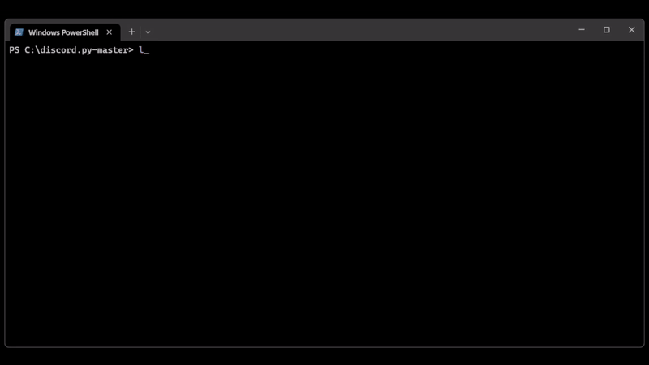

# CodeMap

This script was designed with one goal: maximizing workflow. It empowers users to efficiently prepare a codebase for a language model. Through a navigable tree interface, users can select specific files and then copy them, formatted as a single prompt, directly to the clipboard.

## Demo



## Features

1. SHIFT-based subtree actions: expand/collapse, anonymize/de-anonymize.
2. Single-folder toggles: expand/collapse, anonymize/de-anonymize.
3. Single-file toggles: enable/disable to exclude files from clipboard copying.
4. Clipboard copying of visible, enabled files with a progress bar.
5. State persistence for expanded, anonymized, and file enablement.
6. Selection arrow (`>`) beside the selected entry.

## Usage

Navigate through your directory structure and perform actions using the following key bindings:

- **[W]/[S]**: Navigate the tree
- **[e]/[E]**: Expand/collapse a single folder or entire subtree
- **[a]/[A]**: Anonymize/de-anonymize a single folder or entire subtree
- **[d]**: Enable/disable a single file
- **[c]**: Copy all visible, enabled files to the clipboard
- **[q]**: Quit the application (saves state to `.tree_state.json`)

## Installation

1. **Clone the repository**:

    ```bash
    git clone https://github.com/ylevo-l/codemap.git
    ```

2. **Navigate to the directory**:

    ```bash
    cd codemap
    ```

3. **Install dependencies**:

    ```bash
    pip install -r requirements.txt
    ```
    
4. **Setup CodeMap**:

    ```bash
    pip install -e .
    ```
    
4. **Run CodeMap**:

    ```bash
    codemap
    ```
    
